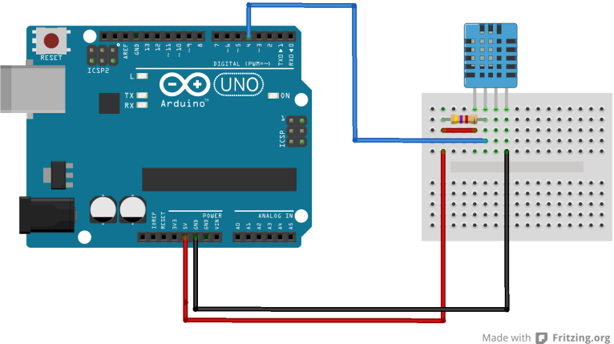

# 🌦️ Weather Monitoring System with Arduino & Node.js

## 📌 About the Project

This project is a real-time **Weather Monitoring System** that integrates an **Arduino Uno** with a **DHT11 temperature & humidity sensor** to collect weather data. The data is processed through **Node.js** and displayed on a responsive **frontend dashboard** using **Chart.js** for real-time graphs. The system can also **remotely sense values and send them to a host**, making it useful for IoT and home automation applications.

## 🚀 Features

- 🌡️ **Real-time temperature & humidity data** collection
- 🔗 **Arduino Uno & DHT11** sensor integration
- 📡 **Node.js backend** for handling serial port data
- 📊 **Real-time chart visualization using Chart.js**
- 🖥️ **Frontend dashboard** to display live weather updates
- 🌐 **Responsive design** for mobile & desktop users
- 🔄 **API endpoint** to fetch weather data for external applications
- ⚙️ **Environment variables** for better configurability
- 📶 **Remote sensing & data transmission** to a host

## 🏗️ Tech Stack

- **Hardware:** Arduino Uno, DHT11 Sensor
- **Software:**
  - **Arduino IDE** (for code uploading & compilation)
  - **Adafruit DHT11 Library**
  - **Node.js** (**Express, SerialPort, WebSockets**)
  - **Frontend:** **HTML, CSS, JavaScript, Chart.js**
  - **Icons:** [Icons8](https://icons8.com/icons/color), [FontAwesome](https://fontawesome.com/search)

## 🔧 How It Works

1. **Arduino Uno** reads temperature & humidity from **DHT11 sensor**.
2. Data is sent via **serial port** to the **Node.js server**.
3. **Node.js** processes and exposes the data via an **API endpoint**.
4. The **frontend dashboard** fetches data from the API and displays it.
5. **Chart.js** is used to render real-time graphs.
6. WebSockets ensure **real-time updates** without page refresh.
7. System **analyzes temperature, humidity, and heat index** to display relevant information.

## 📜 Special Aspects

- 📲 **Mobile Responsive:** The UI is optimized for all screen sizes.
- 📊 **Real-Time Charts:** Data is visualized dynamically using [Chart.js](https://www.chartjs.org/).
- 🔑 **Environment Variables:** Secure and flexible configuration.
- 🔗 **WebSocket Integration:** For seamless real-time updates.
- ⚡ **Efficient Serial Communication:** Ensures smooth data transfer from Arduino to the server.
- 🌍 **Remote Sensing:** Sensors can send data to a remote host.

## 📸 Simulation Image



## 🔗 Live Demo

🌍 [Live Weather Dashboard](#) https://pranavhendre02.github.io/Weather-Project/

## 📥 Installation & Setup

1. **Clone the repository**
   ```sh
   git clone https://github.com/PranavHendre02/Weather-Project.git
   ```
2. **Navigate to the project folder**
   ```sh
   cd weather-monitoring
   ```
3. **Install dependencies**
   ```sh
   npm install
   ```
4. **Run the server**
   ```sh
   node localapp.js
   ```

## 🌟 Contributions

Feel free to contribute by creating pull requests or reporting issues.

## 📜 License

This project is open-source and available under the MIT License.

---

✨ **Created with ❤️ by Pranav Hendre** ✨